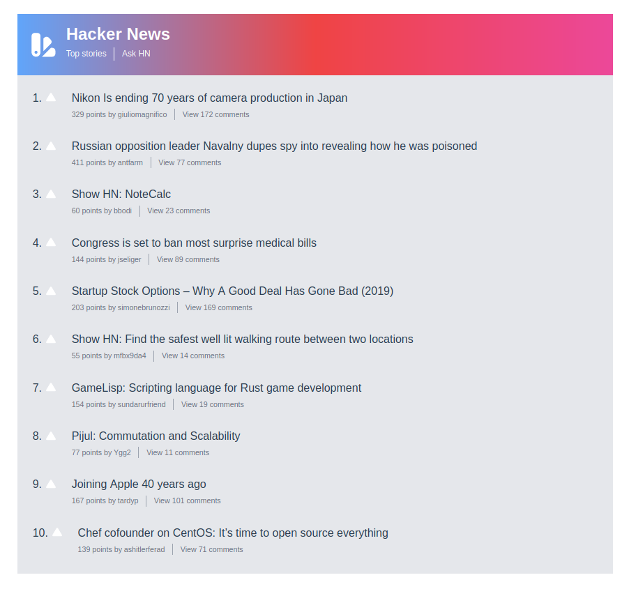

# hacker-news-vueproject

Hacker-news consist of real time data. Throughout this project, Fetch APIs are used for fetching resources from Hecker-news-firebase. Here, only Top 10 stories and Ask HN are displayed with its related comments and users. 



## Project setup
```
npm install
```

### Compiles and hot-reloads for development
```
npm run serve
```

### Compiles and minifies for production
```
npm run build
```

### Lints and fixes files
```
npm run lint
```

### Customize configuration
See [Configuration Reference](https://cli.vuejs.org/config
